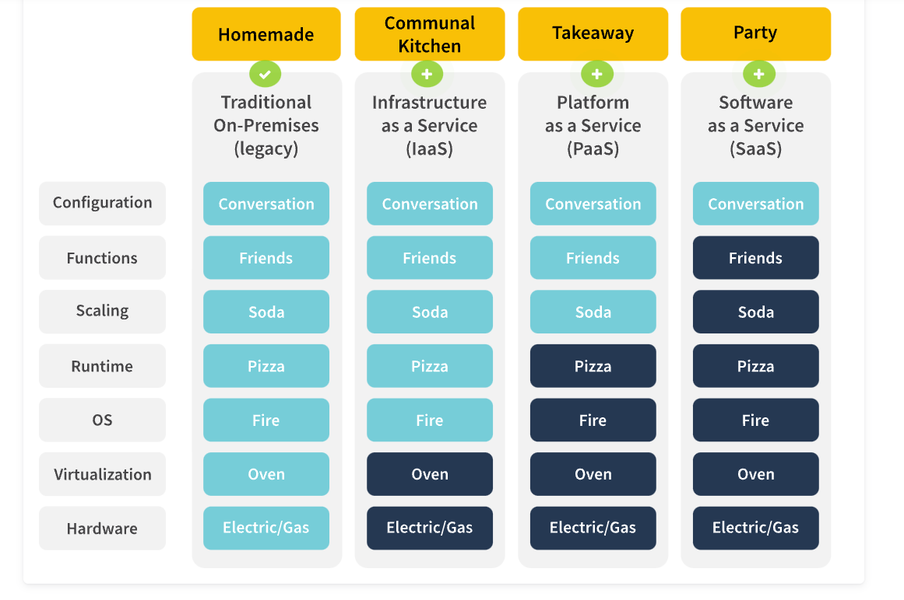

# CloudX Epam Course

- The cloud provides a way of abstracting, pooling, and sharing computing resources—like servers, switches, routers, operating systems, and security software—across a network of devices on or off the premises. Cloud computing refers to the use of these resources over the Internet. Typically, users rent computational resources like storage space or CPU power, while the cloud provider actively manages the hardware (e.g. storage drives and servers) that provide those computational resources. Cloud providers also offer higher level services that analyze data, support disaster recovery, or act as development environments—all of which run on cloud provider hardware.

It may be helpful to think of the cloud as a massive utility like a water or electricity service—there are many similarities.

## Benefits of cloud computing

- Cloud computing presents companies with unlimited opportunities for providing services and products to clients. Implementing a cloud system effectively begins with matching your organization's workloads and data with the appropriate cloud type. To help customers match workloads and data, it's helpful to know a bit about the main characteristics and benefits of cloud computing.

1. Cost Efficiency - pay as you go, pay for what you use
2. Scalability - ability to increase or decrease IT resources as needed to meet changing demand. Both vertical and horizontal. Vertical scaling involves increasing the size of each resource—for example, adding more CPU power or memory to existing servers.
   Horizontal scaling involves adding more resources to your existing clusters—most likely of the same size as existing servers.
3. Elasticity -  refers to the ability to provide or remove resources on demand as your organization's needs change. For instance, imagine your website is featured in a news article, or a special offer you released went viral. Both can lead to a considerable increase in traffic. Since the cloud is elastic, it can automatically allocate more resources to prevent your site from being overwhelmed. When traffic normalizes, the cloud automatically reallocates the resources to minimize cost.
4. Service Variety - Cloud provider services can vary significantly and encompass a wide variety of capabilities
5. Reliability - provides a sense of confidence that your servers and data will always be there.
6. Security - help your organization maintain a high level of security.

## Cloud Types

1. Public Cloud
2. Private Cloud
3. Hybrid Cloud
4. Multi-cloud

- The type of deployment model you select should be based on the number of programs you want to run, how much storage space you need, and your organizational aims.

## Cloud Service Models

1. SaaS - Software as a service delivers an entire software stack to users, who typically just pay for the subscription. The SaaS model requires no application coding and no hosting infrastructure.
2. PaaS - Platform as a service offers an additional layer of abstraction over IaaS, providing necessary components beyond infrastructure. The platform layer typically includes operating systems, pre-built development tools, testing, runtime, middleware, and databases. By leveraging this model rather than managing the platform themselves, developers can focus on functionality that adds business value.
3. IaaS - Infrastructure as a service is what people typically envision when they think of the cloud, as it provides access to the hardware needed to run applications. IaaS essentially replicates a data center using on-prem legacy hardware in a cloud. Companies who opt to run solely on an IaaS computing model choose to do the heavy lifting of designing and maintaining their cloud service. This model requires infrastructure engineers and architects who will be deeply involved in the development and maintenance of the cloud.

## Containers 

- A container is a standard unit of software that packages up code and all its dependencies so that an application runs quickly and reliably from one computing environment to another. A container image is a lightweight, stand-alone, executable package of software that includes everything needed to run an application: code, runtime, system tools, system libraries and settings. Containers are designed to make the DevOps process simple and efficient.
- Like virtual machines (VM), containers provide the infrastructure for your custom code and applications. However, containers make operating a cloud practical, fast, and cost-effective by creating bundles that virtualize at the operating system (OS) level rather than at the hardware level. A single physical or virtual host (a server with an OS) can house multiple containers at the same time. Containers remain lightweight by sharing the OS they run on while isolating processes within user space.

## Docker

- Docker—a popular platform with a large market share—has become synonymous with containers. There are other options for container services, but Docker has become the go-to favorite for custom applications. It is a platform for developing, deploying, and running applications.

## Docker Engines

- The Docker Engine combines open-source container technology with a workflow for building, running, and managing containerized applications. The Docker Engine consists of three major components: Docker Daemon, Rest API, and Docker CLI.

1. Docker Daemon - A service running on the host computer that executes commands. It manages Docker images, containers, networks, and storage volumes.
2. Rest API - An API used by applications to execute Docker commands via the Docker daemon.
3. Docker CLI - A command-line interface developers use to execute Docker commands via the Docker daemon.

## Kubernetes 

- Like Docker, Kubernetes is the most popular orchestration system in the industry. Kubernetes is an open-source container orchestration platform designed to automate deployment, scaling and management of application software in containers. You can run Kubernetes clusters yourself, but you should have specific skills to do that. To simplify container adoption, it is becoming increasingly popular to use a Kubernetes service run by one of the cloud providers in a SaaS model.
- Kubernetes creates an abstraction layer that performes key functions and allows the development team to concentrate on the application functionality.

## Cloud Ownership

- Cloud transformation is unique to every organization and requires a close examination of goals, data, and applications before jumping in headfirst. While organizations are unique, cloud transformation should follow the same vital steps: assessment, preparation, migration, and operation.

### Cloud Economics 

- One of the most topical questions your clients might have, is: “How does a company calculate the cost of moving to cloud?”. That’s where cloud economics come in especially handy with its concept of total cost of ownership, or TCO.
- The total cost of ownership in cloud computing refers to the total cost of implementing, running, and provisioning cloud infrastructure. 

### Cloud Migration 

- The next step to cloud transformation is to prepare for cloud migration process. This requires evaluation of the pros and cons of cloud adoption, choosing a migration strategy and carefully planning each action point. Before that, you need to grasp the concept of cloud migration.
- Cloud migration involves moving your applications and data store from on-premises hosting sites to the cloud. Cloud migration is similar to a physical relocation but instead of packing and transferring real objects, it entails moving data, apps, and IT processes from one data center to another. While the concept is straightforward, its implementation is complex, requiring in-depth planning and a well-formulated strategy.
- A cloud migration strategy provides the roadmap for getting this done and offers various benefits to organizations. The preparation step is all about building the right strategy and following it through the next stage—migration.
