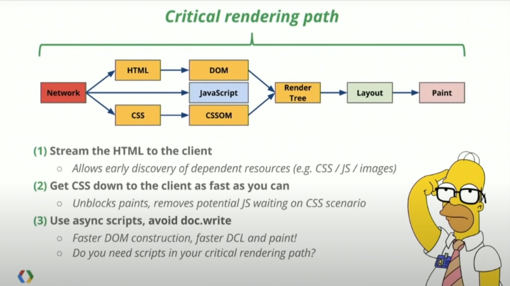

# Critical Rendering Path

- https://www.youtube.com/watch?v=PkOBnYxqj3k&ab_channel=IlyaGrigorik
- https://kb.epam.com/display/EPMCJSCC/Critical+Rendering+Path

## Critical Rendering Path Example

- This already won't render on a 3G network under 1s.
- Why? We can already see that we are getting the JS before creating the DOMs, so that will block rendering.
- How to fix it? We need to start inlining things:
 1. Lets first inline our critical css. What is that? Maybe our header, or some important image, etc...
 2. Ideally, we don't even need our JS at the top. Do we really need our JS at the top to block rendering? Most of our code can be added after our app renders.

- We can go to our Chrome Dev Tools -> Lighthouse.

## Inlining according to AI

Inlining resources as a part of optimizing the critical rendering path means adding important, small-size CSS and JavaScript directly into your HTML document rather than linking to external files. This can improve the rendering speed of a webpage and reduce the number of round-trips required to fetch external resources, which can directly impact the time it takes to render a web page.

The Critical Rendering Path refers to the sequence of steps the browser has to take to convert the HTML, CSS, and JavaScript into actual pixels on the screen. The goal is to optimize this process to render the page as quickly as possible.

Inlining is beneficial for resources crucial for the first paint of your website (the first content the user sees), such as:

1. Some essential CSS styles necessary for above-the-fold content.
2. Certain JavaScript functions needed for the initial view.

By reducing the need to fetch these resources separately, you can speed up the process significantly. However, inlining should not be used indiscriminately because doing so for larger resources can slow down page loading. It can also eliminate browser caching benefits that come with external files.

Remember, the goal is always to ensure a fast, responsive site, and techniques should be chosen with that goal in mind. Inlining is just one technique among many for optimizing the critical rendering path.

