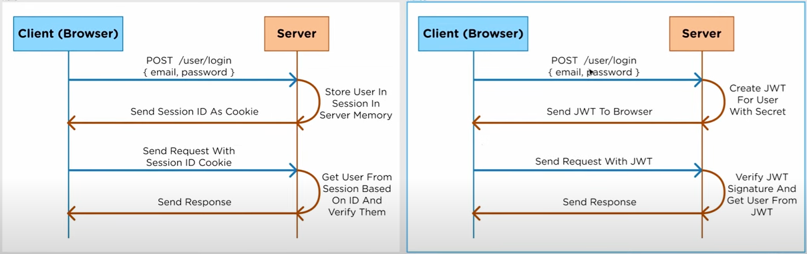

# JWT - JSON Web Token

- https://www.youtube.com/watch?v=7Q17ubqLfaM&t=670s&ab_channel=WebDevSimplified

## What is JWT used for?

- Used for authentication, so for making sure the user that sends the request is the same user that actually logged in during the authentication process.
- Often was done by session id and cookies, but with JWT we use JSON Web Tokens.

## How does it work?

## Why use it?

- We have a Bank server and a Retirement server and they want their users to be able to switch between the two without needing to log in again.
- Client requests to log in to the bank server. If we are on a normal session based authentication, then the user is only stored only on the Bank server.
- If we are using a JWT, the user info is stored on the CLient, on the token, they can seamlessly switch between the two servers.
