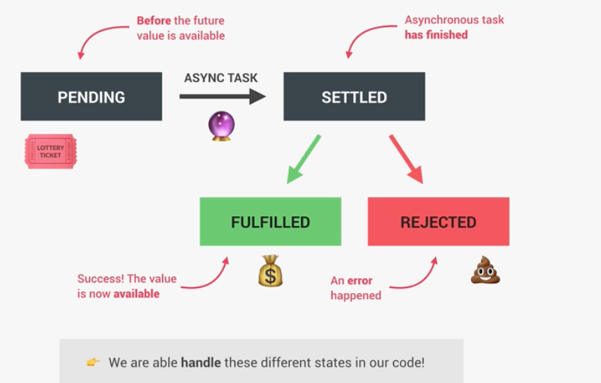

# AJAX

- Asynchronous JavaScript And XML: Allows us to communicate with remote web servers in an async way. With AJAX calls, we can request data from web servers dynamically.
- API - Application Programming Interface - a piece of software that can be used by another piece of software, in order to allow applications to talk to each other.

## Promises and Fetch API

- A more modern way of doing AJAX calls. 
- An Object that is used ass a placeholder for the future result of an async operations.
- Two advantages: 
1. We don't have to rely on any events and callbacks
2. We don't have callback hell anymore, because we can chain requests

### The promise lifecycle

- Although, the `fetch api` returns a promise, and then we can just consume it.
- We can use the `Promise.all([])` to run promises in parallel.
