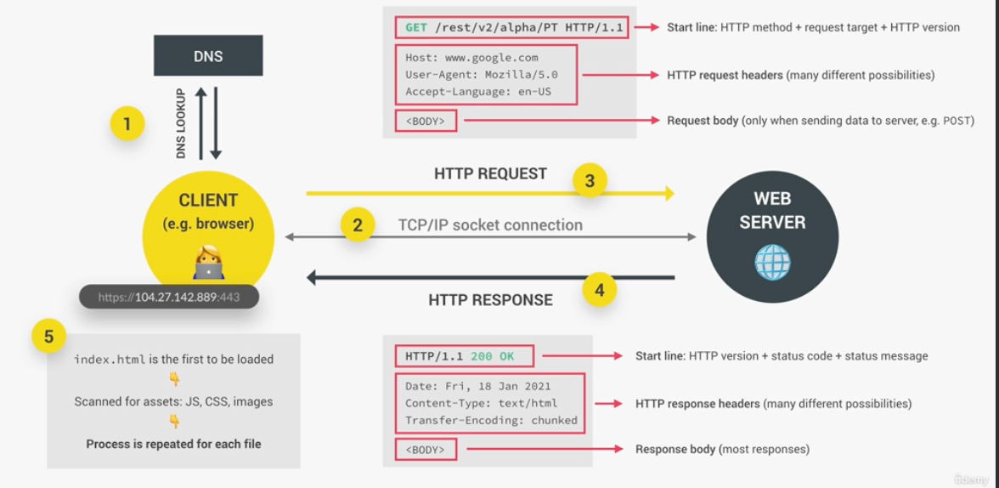

# How do Web Hooks work?

- The response we get contains the data we requested from an API.
- This is called the Request-Response Model.
- DNS - Domain Name Server, special kind of server, phone books of the internet. When we send a request, the browser does a DNS lookup and finds a match to the servers real IP address.
- TCP/IP - transmission control protocol and internet protocol, define how data travels through the web.
- HTTP Request - communication protocol, allows clients and web servers to communicate.
- HTTP Response - response from the web server

