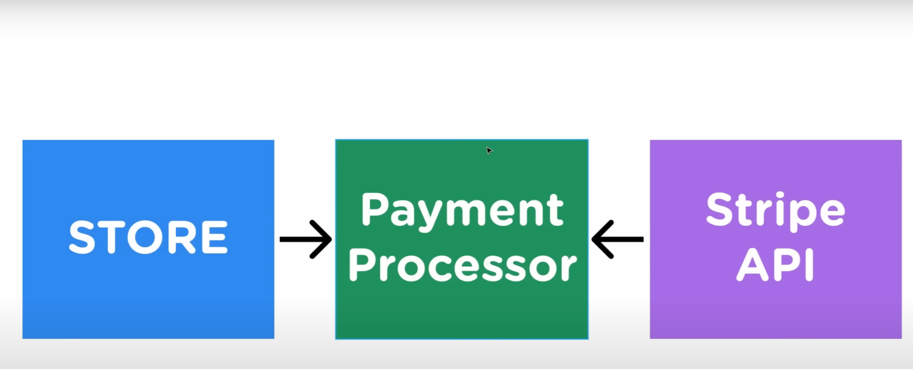

# SOLID Principles

1. Single responsibility - a class should do one thing and one thing only. 
2. Open/Close principle - code should be open to extension but closed to modification. When we are adding a new functionality, we should be able to do so without modifying the existing code. We wrote a lot of unit tests after all, modifying the code would lead to these unit tests failing. Using the **Decorator** pattern. Instead of modifying the  existing code, we can create a new class that implements the same interface.
3. Liskov Substitution - a child class should be able to do whatever the parent can. Anywhere in the code we can change the parent instance to a child, it should work.
4. Interface Segregation - Sometimes a class would inherit a method it doesn't need. (Happens in the repository pattern). We can split the methods in different interfaces. 
5. Dependency Inversion - high level modules shouldn't depend on low-level modules, instead both should depend on abstractions. We can create an interface, and inject an instance of that into a module. (Example: a database). Let's say we have a store that directly calls the Stripe API for payments. This would also make testing much harder. What if we want to switch to paypal, or add paypal as a new payment method atop of stripe? Instead, we can implement a `payment processor`. This is also called the `Fascade pattern`

