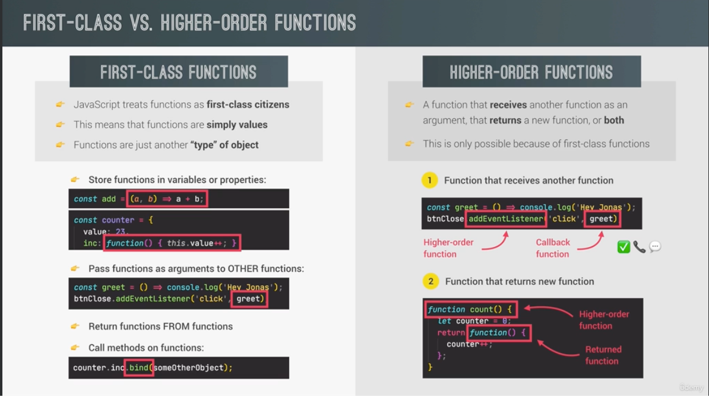
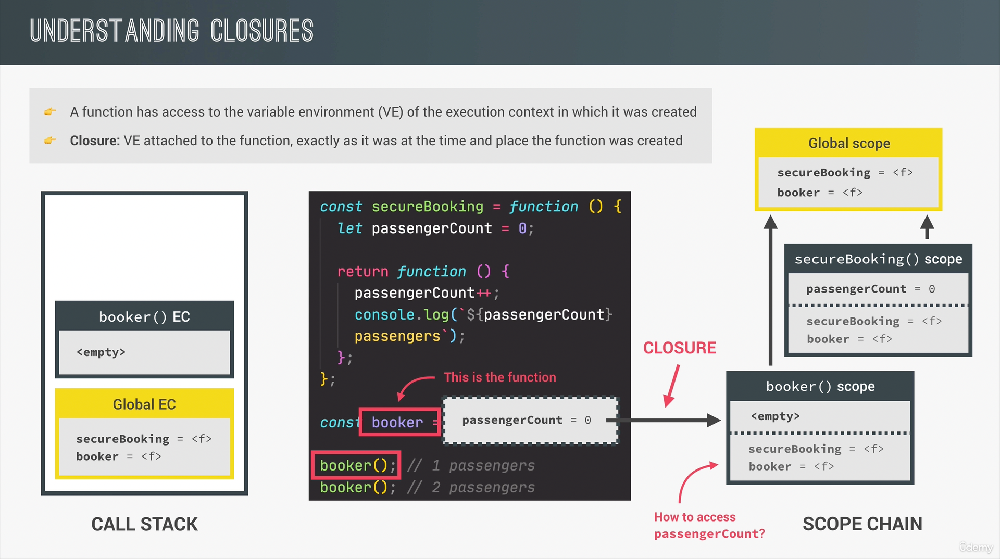
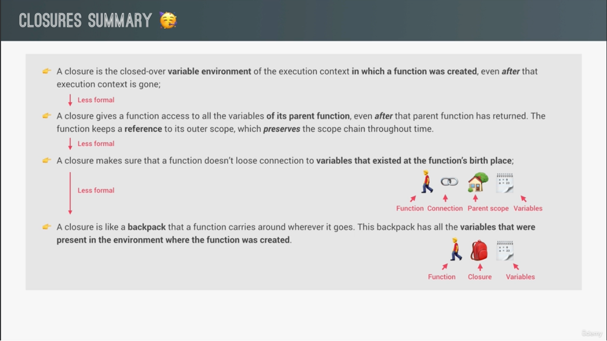

# Functions 

## Default Parameters

```javascript
const bookings = [];

const createBooking = function(flightNumber, numPassangers = 1,price = 199 * numPassangers){
    //ES5 way of doing it
    // numPassangers = numPassangers || 1;
    // price = price || 199
    const booking = {
        flightNumber,
        numPassanger,
        price
    }
    console.log(booking);
    bookings.push(booking);
}
```
## How Passing Arguments Works: Value vs. Reference

```javascript
const flight = 'LH234';
const jonas = {
    name: 'Leonard Posa',
    passport: 12312312312
}

const checkIn = function(flightNum, passenger) {
    flightNum = 'LH999';
    passenger.name = 'Mr.' + passanger.name;
    
    if(passanger.passport === 12312312312 ){
        alert('Check in')
    }else{
        alert('Wrong Passport')
    }
}

checkIN(flight,jonas)

// is the same as doing
const flightNum = flight;
const passanger = jonas;

//two objects, and both point to the same object in memory


//Above function, we have one primitive type and one reference type. Passing the primitive type into the function will result in a new variable, so if we console .og out the flight variable, it will still give the LH234 result.
//AS for the object, since it's a reference type, passing the object into the function will mutate that object, and the values will be changed.

const newPassport = function(person) {
    person.passport = Math.trunc(Math.random() * 100000);
    
}

newPassport(jonas)
checkIn(flight,jonas);
// this will say wrong password!
```
- Javascript does not have passing by reference, only by value, even if the above looks like passing by reference. 
- We do pass a reference, but that reference in this case is a value

## First-class functions and higher-order functions

- First-class functions mean that functions are treated as values. This also means that functions  are just another type of objects.
- This means we can pass functions as values, we can pass them as values to objects, as arguments to other functions, etc...
- We can also return functions from functions
- A higher order functions is a function that receives a functions, or returns another function. 




## The call and apply Methods

- The `call` method allows us to explicitly set the `this` keyword.
- Apply method, does the same thing, but it doesn't receive arguments after the this, but an array
- Apply is not used that much anymore.

```javascript
const lufthansa = {
    airline: 'Lufthansa',
    iataCode: 'LH',
    bookings: [],
    book(flightNum, name){
        console.log(`${name} booked a seat on ${this.airline} flight ${this.iataCode}${flightNum}`)
        this.bookings.push({flight: `${this.iataCode}`})
    }
    
}

lufthansa.book(239, 'Leonard Posa')
lufthansa.book(635, 'John Smith')

const eurowings = {
    airline: 'Eurowings',
    iataCode: 'EW',
    bookings: [],
    
    
}

const book = lufthansa.book;
book(23, 'Sarah W.') 
// this will give us undefined. Why? Because now, book is a copy of the method, but it became a function. So, its this keyword will be different than the one in the method.
// we need to tell JS explicily where the this should point to

book.call(eurowings, 23, 'Sarah W.')


const swiss = {
    airline: 'Swiss Air Lines',
    iataCode: 'LX',
    bookings: []
}


// Apply method, does the same thing, but it doesn't receive arguments after the this, but an array

const flightData = [583,'George Cooper'];
book.apply(swiss, flightData)
```

## The bind Method

- Allows us to `manually` set the `this` keyword, same as `call`. The difference is that `bind` does not call the function, but creates a function.
- We can pass even more arguments that needed
```javascript

// we preset one of the variables here for example, and then we just need to pass the name
const bookEW23 = book.bind(eurowings, 23);
bookEW23('Leonard Posa');
bookEW23('Someone Someone');

// with events listeners 
lufthansa.planes = 300;
lufthansa.buyPlanes = function() {
    console.log(this);
    
    this.planes++;
    console.log(this.planes);
}
//this wont work, in this case, this keyword points to the element the functions was called on
document.querySelector('.buy').addEventListener('click', lufthansa.buyPlane)

// we can use the bind here
document.querySelector('.buy').addEventListener('click', lufthansa.buyPlane.bind(lufthansa))


// partial application, we can preset parameters

const addTax = (rate,value) => value + value * rate;

// lets say we have one tax that we use all the time
// we dont care about the this keyword here, and we just preset the rate
const addVAT = addTax.bind(null, 0.23);
// now we can call it only with the value

console.log(addVat(100));


// challenge: create a function that returns a function from the above example
function addTax2(rate) {
    return function(value){
        return value + value * rate;
    }
}

const addVAT2 = addTax2(0.23);
console.log(addTax2(100))
```

## Immediately Invoked Function Expressions

-  A function that is called ONCE, then disappeared forever
- Why is this important? Scoping. This data is encapsulated and private. This is a perfect use for that.
- Not used that much anymore, since ES6 we have `let` and `const`
```javascript

(function(){
    console.log('This will happen once')
})();
```

# Closures

- Closures happen automatically, we just need to recognize them.
- A closure basically remembers the variables that existed at the functions birthplace.
- Any function always has access to the variable environment of the execution context in which the function was created.
- A closure has priority, so even if the same variable exists in the global scope, at execution, it would still look at the closure first.
```javascript

const secureBooking = function() {
    let passengerCount = 0;
    
    return function(){
        passengerCount++;
        console.log(passengerCount);
    }
}

const booker = secureBooking();

// How will these execution context have access to the passaengerCount variable?? Answer: closures
booker();
booker();
booker();
```



- More closure definitions:



## More closure examples 

```javascript

//example 1

let f;
const g = function() {
    const a = 23; 
    f = function(){
        console.log(a);
    }
}

const h = function(){
    const b = 777;
    f = function() {
        console.log(b * 2);
    } 
}

g();
f();
h();
f();

// Example 2
const boardPassengers = function(n,wait){
    const perGroup = n / 3;
    
    setTimeout(function(){
        console.log(`We are boarding all ${n} passengers`);
        console.log(`There are 3 groups, each with ${perGroup} passengers`)
    }, wait * 1000)
    
    console.log(`Will start boarding in ${wait} seconds`)
} 

boardPassengers(180, 3);

//Even though the setTimeout happens after the boardPassengers is finished execution, it still has access to all variables.
```


- Link to content: https://www.udemy.com/course/the-complete-javascript-course/learn/lecture/22648687#reviews