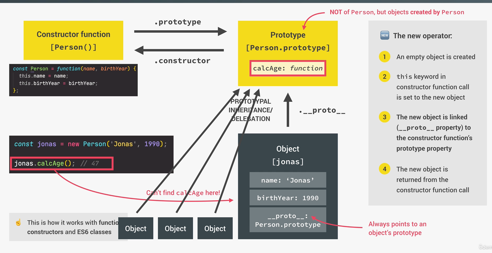
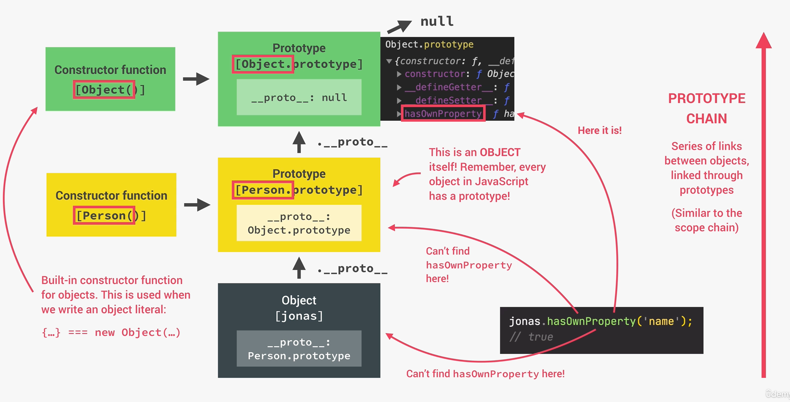
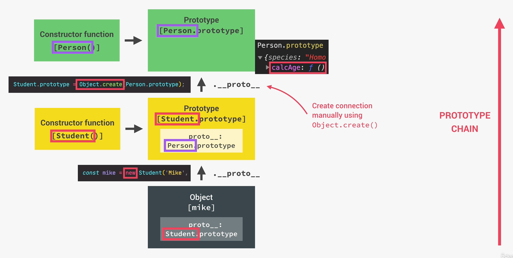

# OOP in Javascript

## Prototypes

- All objects are linked to a prototype. The prototypes contain all methods an object can use.
- Prototypal inheritance: The prototype contains methods (behaviour) that are accessible to all objects linked to that prototype.
- This means instance is inheriting from a class. (not a class from class)
- Behaviour is delegated to the linked prototype object. In traditional OOP, behaviour (methods) are copied from class to instance.


### Constructor functions

```javascript
const Person = function(firstName, birthYear) {
    this.firstName = firstName;
    this.birthYear = birthYear;
    
    // never do this!!! never create method inside of the constructor
    this.calcAge = function() {
        console.log(2037 - this.birthYear);
    }
}

const leo =- new Person('Leo', 1997)
// 1. New {} is created
// 2. function is called, this = {}
// 3. {} linked to prototype
// 4. function automatically return {}


// Protypes 
// since prototypal inheritance, any instance (object) will have access to this method
Person.prototype.calcAge = function () {
    console.log(2037 - this.birthYear)
}

leo.calcAge();

console.log(leo.__proto__) // this will print out the prototype

```



- When we call the `leo.calgAge()` method, JS looks into the Object, doesn't find it there, so it looks in the prototype, which the object has a reference too and finds it there.
- This is essential for better performance, because, imagine if each object would need its own `calcAge()` function.




## Inheritance in between "classes"


### Using classical prototypes

```javascript
const Person = function(firstName, birthYear) {
    this.firstName = firstName;
    this.birthYear = birthYear;
    
    // never do this!!! never create method inside of the constructor
    this.calcAge = function() {
        console.log(2037 - this.birthYear);
    }
}

const Student = function (firstName, birthYear, course) {
    Person.call(this, firstName, birthYear);
    this.course = course;
}

Student.prototype = Object.create(Person.prototype)

Student.prototype.introduce = function() {
    console.log(`My name is ${this.firstName} and I study ${this.course}`)
}

const mike = new Student('Mike',2020, 'CS');
```



### Using classes

```javascript

class Student extends Person {
    constructor(fullName, birthYear, course) {
        // this has to happen first, basically does the same as Object.create(Person.prototype)
        super(fullName, birthYear)
        this.course = course;
    }
    
    introduce() {
        console.log(`My name is ${this.firstName} and I studty ${this.course}`)
    }
}

const martha = new Student('Martha Jones', 2012, 'CS');
```

### Object.create() inheritance

```javascript
const PersonProto = {
    calcAge () {
        console.log(2037 - this.birthYear)
    },
    init(firstName, birthYear) {
        this.firstName = firstName;
        this.birthYear = birthYear
    }
}

const steven = Object.create(PersonProto)

const StudentProto = Object.create(PersonProto)
StudentProto.init = function(firstName, birthYear, course) {
    PersonProto.init.call(this,firstName,birthYear);
    this.course = course;
}

StudentProto.introduce = function () {
    console.log('Introduce')
}

const jay = Object.create(StudentProto)
jay.init('Jay', 2010, 'CS')
```

## Another example of OOP and ENCAPSULATION

```javascript
class Account {
    constructor(owner, currency, pin) {
        this.owner = owner;
        this.currency = currency;
        // PROTECTED values _
        this._pin = pin;
        this._movements = []; // the _ doesnt make it truly private, but it's a convention, this is PROTECTED
        this.locale = navigator.language
        
        console.log(`Thanks for opening an account ${owner}`)
    }
    
    //Public intreface of our objects
    getMovements() {
        return this._movements;
    }
    
    deposit (val) {
        this._movements.push(val)
    }
    
    // Withdrawal is acutally abstraction, we are abstracting the fact that withdrawal is just negative deposit
    withdraw (val) {
        this.deposit(-val)
    }
    
    //PROTECTED method
    _approveLoan(val) {
        return true;
    }
    
    requestLoan(val) {
        if(this._approveLoan(val)){
            this.deposit(val);
            console.log('Loan approved')
        }
    }
    
}

const acc1 = new Account('Leo', 'EUR', 1111);
console.log(acc1)

// if we now do 
acc1._movement.push(250); 
// we at least know in our team that this variable is protected and we shouldt manipulate it

```

### Truly private fields

```javascript
//  Public fields, Private Fields, Public Methods, Private Methods

class Account {
    // Public fields (instances)
    locale = navigator.language;
   
    
    // Private fields
    #movements = []; 
    #pin; //we dont assign anything in it, because we have to set it in the constructor
    
    constructor(owner, currency, pin) {
        this.owner = owner;
        this.currency = currency;
        // PROTECTED values _
        this.#pin = pin;
        
        console.log(`Thanks for opening an account ${owner}`)
    }
    
    //  Public methods
    getMovements() {
        return this.#movements;
    }
    
    deposit (val) {
        this.#movements.push(val)
    }
    
    // Withdrawal is acutally abstraction, we are abstracting the fact that withdrawal is just negative deposit
    withdraw (val) {
        this.deposit(-val)
    }
    
    //PRIVATE methods, not working in any browser yet
    #approveLoan(val) {
        return true;
    }
    
    requestLoan(val) {
        if(this.#approveLoan(val)){
            this.deposit(val);
            console.log('Loan approved')
        }
    }
    
}

const acc1 = new Account('Leo', 'EUR', 1111);
console.log(acc1)

// if we now do 
acc1._movement.push(250); 
// we at least know in our team that this variable is protected and we shouldt manipulate it

```