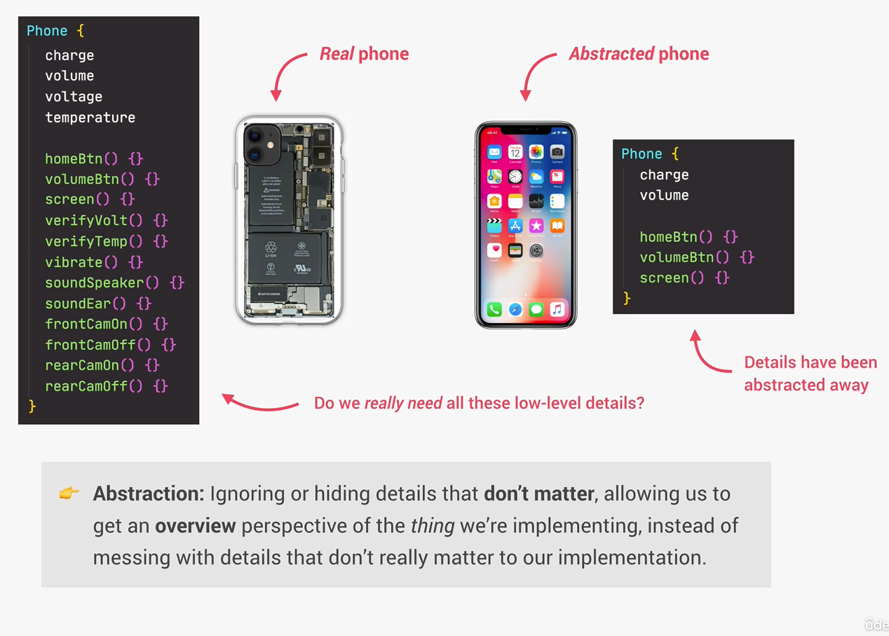

# Object Oriented Programming

## 4 principles of OOP

### Abstraction

- Ignoring or hiding details that **don't matter**, allowing us to get an **overview** perspective of the thing we're implementing, instead of messing with details that don't really matter to our implementation.

- Another example: The Add Event Listener, do we actually know what happens behind the scenes? No. Do we care? No. The details have been abstracted from us.

### Encapsulation

- Keeping properties and methods **private** inside the class, so they are **not accessible from outside the class**. Some methods can be **exposed** as a public interface (API).
- Why? Prevents external code from accidentally manipulating internal properties/state. 
- Also, allows to change internal implementation without the risk of breaking external code.

### Inheritance

- Making all properties and methods of a certain class **available to a child class**, forming a hierarchical relationship between classes. This allows us to **reuse common logic** and to model real-world relationships.
- Helps us avoid duplicate code. 
- We have one parent class and a child class. Example: User and Admin. 

### Polymorphism

- A child class can overwrite a method it inherited from a parent class.
- Using the above example, lets say the login of the admin needs something extra, like 2FA. This is where polymorphism comes in handy.

