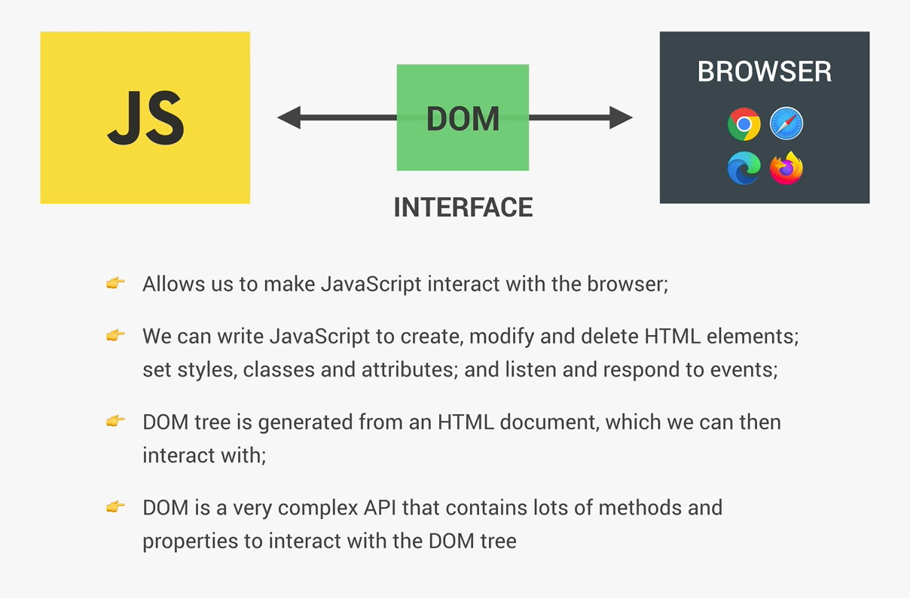
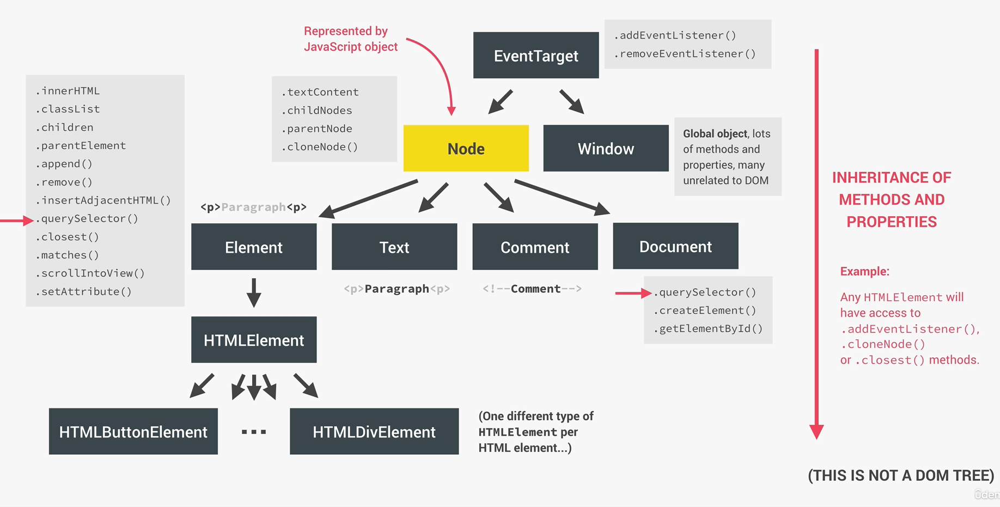
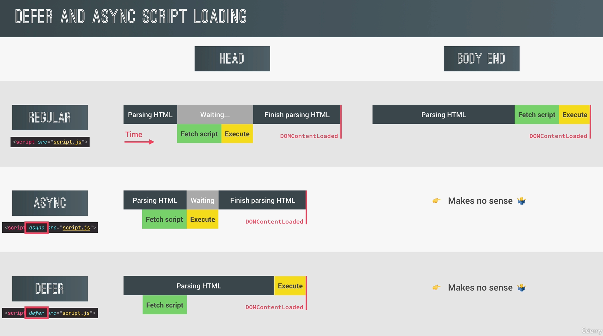
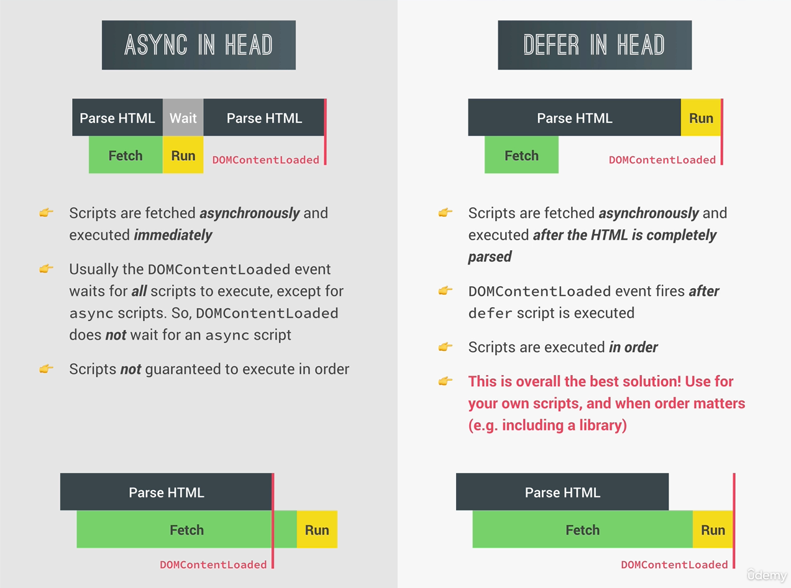

# DOM

## What is the dom? 

- Interface between JS and our Browser.



## How the DOM API is organized behind the scenes?

- Each node is the type of node.
- Each node is represented by an object that has access to many properties such as `.textContent` `.childNodes` ...
- Each node has a couple of child types. Element, text, comment and document types.
- The element type has a child HTMLElement which has a child for example HTMLButtonElement.
- Each of these types has a specific set of properties. For example, images have the source, while buttons don't.
- Inheritance of method and properties. Example: Any HTMLElement will have access to `.addEventListener()`, `.cloneNode()`, etc..
- The listening to events is possible because the special node type `EventTarget`. All elements inherit the methods of it.




## Even propagation: Bubbling and Capturing

- Let's say we have a `a` tag somewhere, that is a child of a `p` tag, `section`, `body`, `html` and finally `document`.
- If we call a click event on the `a` tag, it actually gets generated  at the root, rather than the element itself.
- The event then travels through all elements until it reaches the correct element. This is called the `capturing phase`.
- The next is the `target` phase, where the correct element is reached. 
- And then the `bubbling` phase, where it travels back up to the root.
- Why is this important? If we attach the exact same event to the `section` tag, we would handle the same event twice.

According to AI: 

```javascript
document.querySelector("#child").addEventListener('click', (event) => {
  alert("Child clicked!");
});

document.querySelector("#parent").addEventListener('click', (event) => {
  alert("Parent clicked!");
});
```

When you click the "Click me!" button (child), two alerts will pop up: one saying "Child clicked!" and the other saying "Parent clicked!". This is because the click event bubbles up from the “child” to its “parent”.

Even though you clicked on the button, the event travels up to its parent, triggering any click events on its way. That's why you've got two alerts: one from the direct button click, and the other from the event bubbled up to the div.

When you're adding event listeners to an element, remember that event handlers aren't only run on that specific element, but also its parents, due to event bubbling. This is important to remember for preventing unintended side effects in your JavaScript code.


## Example of Event Delegation 

- Lets say we have a navbar, with a lot of buttons
```javascript

document.querySelector('.nav__link').forEach(function(el){
    el.addEventListener('click',function (e) {
        e.preventDefault();
        const id = this.getAttribue('href');
        console.log(id);
        document.querySelector(id).scrollIntoView({
            behaviour: 'smooth'
        })
    })
})
```
- This is quite unnecessary. Lets say we have 10 000 `nav__link` elements, that means this function will be created 10 000 times.
- A better solution would be to use `event delegation`. This uses the fact that the events bubble up. This means we can attach the event to the parent.

```javascript
document.querySelector('nav__links').addEventListener('click', function(e){
    if (e.target.classList.contains('nav__link')) {
        e.preventDefault()
        const id = e.target.getAttribue('href');
        document.querySelector(id).scrollIntoView({
            behaviour: 'smooth'
        })
    }
})
```

## Passing arguments to even handlers

- Remember that event handlers expect a function, and you cant simply just pass a value instead.


```javascript
const test = function(e,arg1){
    console.log(arg1)
}
//this wont work!
element.addEventListener('click',test)

//instead do this
element.addEventListener('click',function(e){
    test(e,'argument')
})
//OR
element.addEventListener('click', test.bind('argument'))
```

## Lifecycle DOM Events

1. DOMContentLoaded - html is parsed and dom tree is built. Does this mean we need to wrap our scrips with this event? No. If we put our `<scrip>` file at the end of our html, this is always going to happen.
2. Load event - fired by the window when all external files such as images are loaded.
3. `beforunload` - fired before user leaves page


## Defer and Async Script Loading

1. Never load script in the head, but at the body end.
2. In Async, fetching the script happens WHILE parsing the HTML. But then its executed in a sync way.
3. The Defer, script is loaded async, but is executed at the end. This is exactly what we want. 
4. Async and Defer don't make sense in the Body. They have no effect there.


