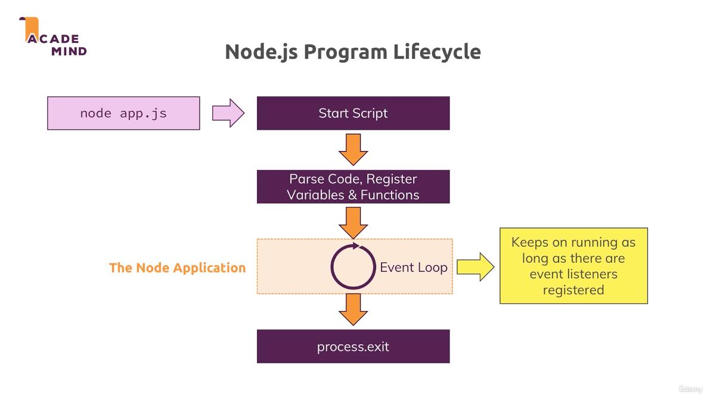
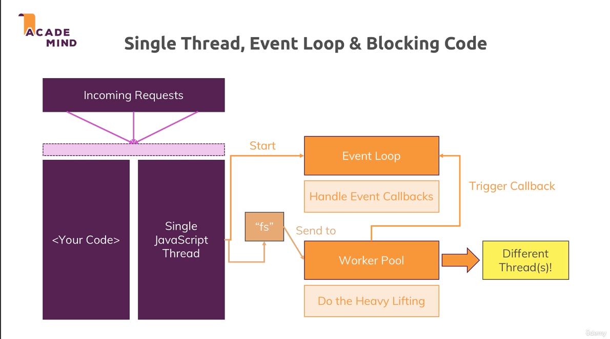
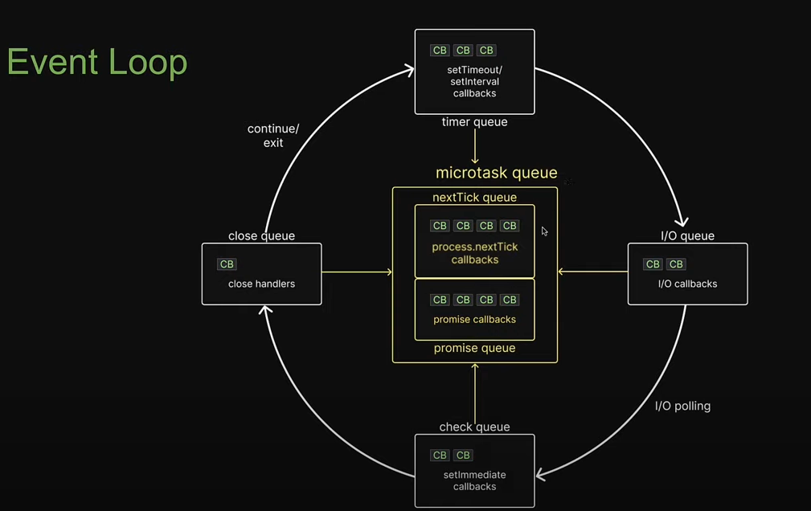
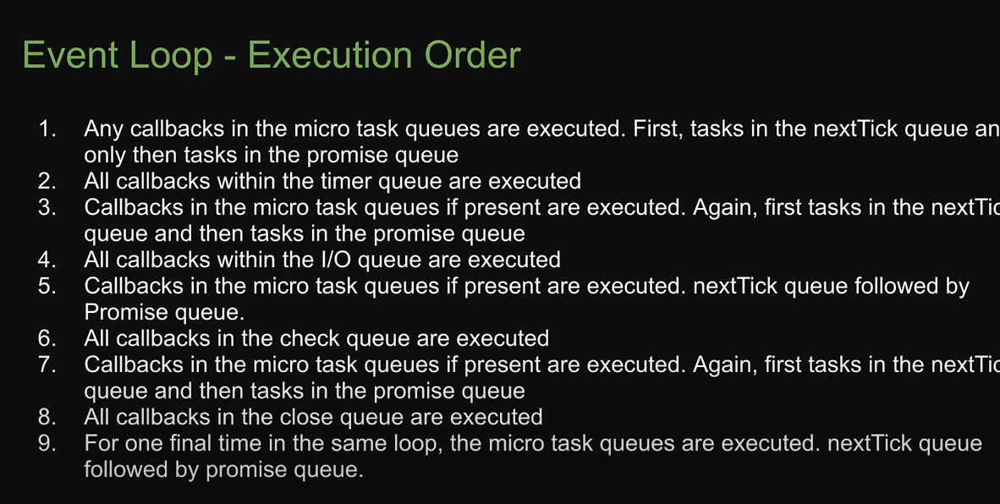

# Core Modules

1. http -> Launch a server, send requests
2. https -> launch a SSL server
3. fs
4. path
5. os

# The Node Lifecycle & Event Loop

```javascript
const http = require('http')

const server =http.createServer((req,res)=>{
    console.log(req);
    // process.exit() - exit the event loop
})

server.listen(3005);

```




# Streams and Buffers

- Node handles requests in parts, we have a stream of data, and the request is read in multiple chunks or parts. This is done because Node.js doesn't know how big the request actually is, and to be able to handle data in chunks and not wait for the whole data to be parsed (imagine if we don't have this ability and then we have a huge request, we would have to wait a lot for it)
- Buffer is like a bus stop, a construct, which allows us to hold multiple chunks and work with them before they are released.

# Behind the Scenes

### Single Thread, Event Loop & Blocking Code

- Node.js uses one single thread. How does it then handle multiple requests?
- The `event loop` handles event callbacks, that contain fast finishing code.
- Slower operations, such as the `fs` operations get send to the `Worker Pool` which does the heavy lifting.
- The `Worker Pool` has different threads.
- Once the operation in the `worker pool` is done, it triggers a callback in the event loop.




### The Event Loop

- Handles all the callbacks. 
- At the beginning of each loop, it checks if there are any timer callbacks to be executed.
- Next step is to check other callbacks, such as I/O, callbacks that were deferred. 
- Then comes the Poll phase. A phase where Node.js will look for new I/O events and complete their callbacks if possible. If not, it will defer them.
- Check phase. Execute `setImmediate()` callbacks.
- Close Callbacks. Execute all `close` event callbacks.
- At the end we can exit the event loop, `process.exit`, if there are no events anymore to handle. This very RARELY happens.





