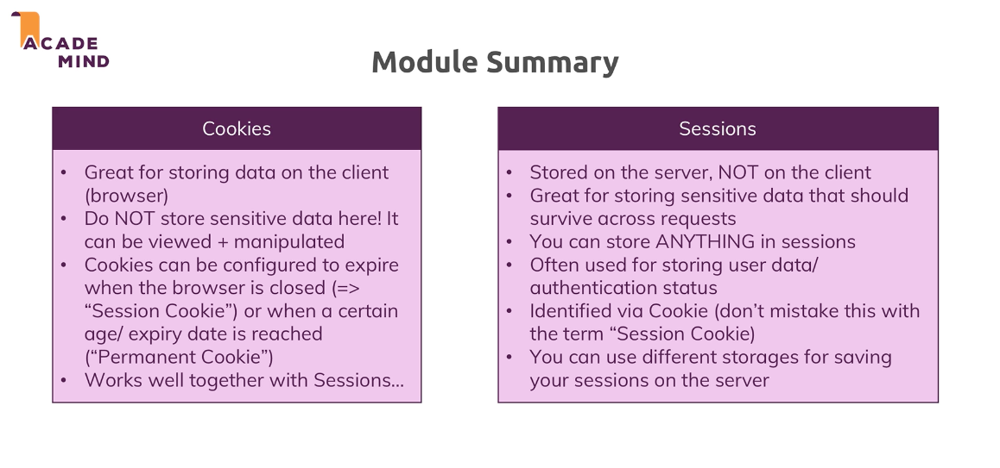

# What is a cookie?

- Sent via Response Header
- A cookie is a small piece of data that a website stores on a user's computer or device. Cookies are used to remember information about the user's browsing activity or preferences on the website. They are typically sent by the web server to the user's browser and then stored locally on the user's device.

# What is a session? 

- A session, in the context of web development, refers to a period of interaction between a user and a web application or website. During a session, a user performs various actions such as browsing pages, submitting forms, and interacting with content.

- In Node.JS we can use express-session package to handle sessions.

