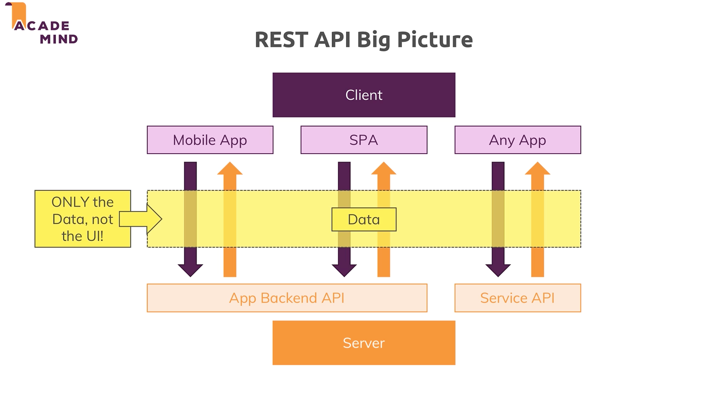

# REST APIs

## What are these?

- Not every UI requires HTML Pages. 
- The Twitter app for example, doesn't need server side rendering, instead it uses a UI built in java, react native. They are built completely decoupled from the server.
- Javascript scripts reach out to a restful api, and get the  data they need for their client.
- Frontend is decoupled from the Backend, this is the core idea of REST API.
- **Re**presentational **S**tate **T**ransfer - transfer data instead of user interfaces

## Routing

- We send a request using a `HTTP` method, from a client to server, with `async` calls.
- These are also called  `API Endpoints`. We defined these endpoints and what happens we reach out to them.

## REST Principles

1. Uniform Interfaces - Clearly defined API Endpoints, with clearly defined request + response data structure.
2. Stateless Interactions - Server and client don't store any connection history, every request is handled seperately.
3. Cacheable - servers may set caching headers to allow client to cache responses
4. Client-Server - server and client are seperated

## REST vs. GraphQL

REST (Representational State Transfer):

REST is an architectural style and doesn't come with a particular data format. However, JSON is the most popular.
In REST, the server defines what data is sent. There can be data over-fetching or under-fetching. To get around this, APIs have to be redesigned frequently.
REST APIs often require multiple round trips to different endpoints to fetch related data.
GraphQL:

GraphQL is a query language and runtime for APIs.
The client decides exactly what data it needs which often leads to fewer bytes sent over the wire, therefore improving performance.
A single request to a GraphQL API can replace multiple REST requests because it can fetch related data without additional network requests.
