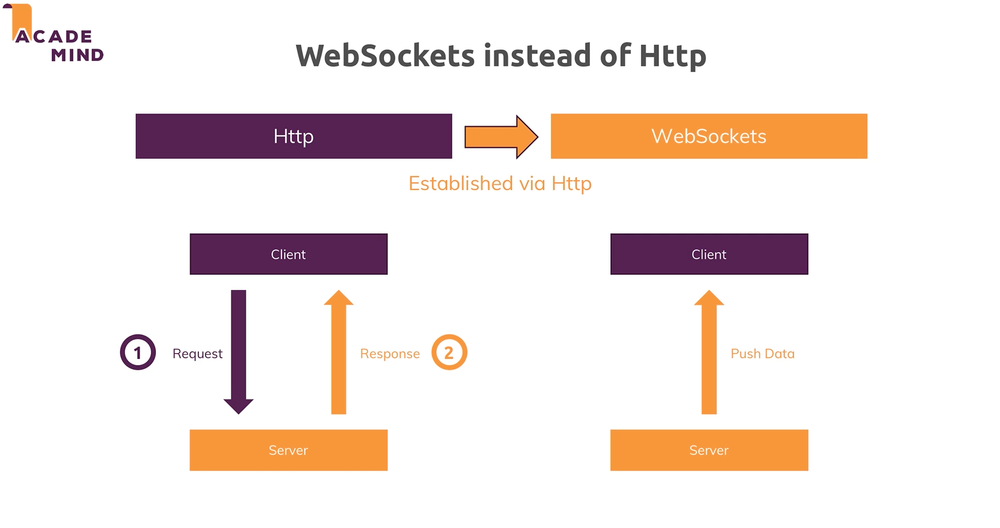

# Websockets

- Allow us to build realtime web services. 
- What is something changes on the server and we want to inform the client?

## Examples

- Imagine we have Client A and Client B and Client A adds a new product to our server. With the use of websockets, Client B would be able to see the changes right away, in realtime.
