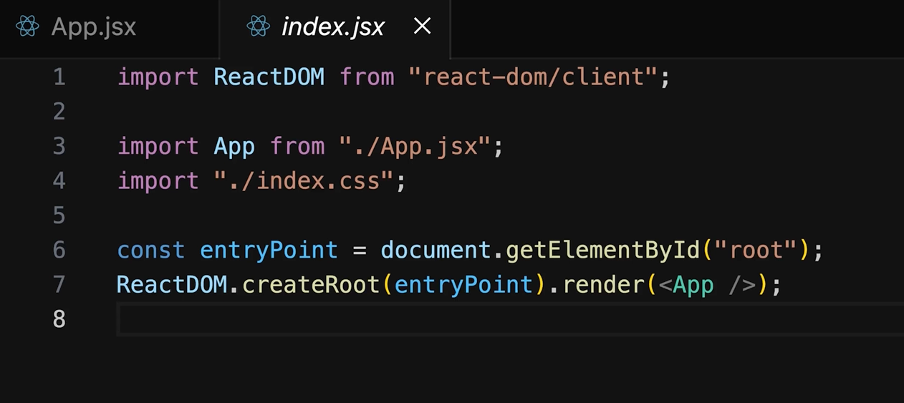
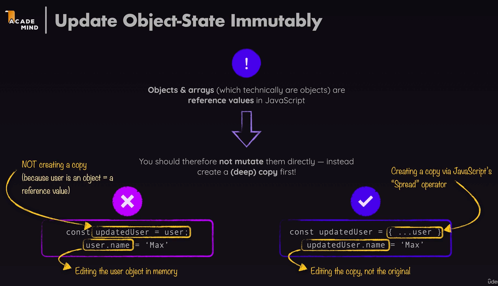

# How react handles Components and how it builds a "Component Tree"

- Link to course: https://www.udemy.com/course/react-the-complete-guide-incl-redux/learn/lecture/39649006#overview



- The `render` and `createRoot()` methods are responsible for rendering a single root component, which then includes the rest of our React App components.
- We then have a **Component Hierarchy** or a **Component Tree** which React analyzes and goes through it step by step.
- React generates the DOM Node tree after analyzing the **Component Tree**.


# Updating Object-state immutably

- Objects and arrays are reference values in JS.
- You should therefore not mutate them directly, instead create a (deep) copy first. 


### According to AI:
Updating objects immutably is particularly emphasized for reference types (such as objects and arrays) because of the way JavaScript handles variable assignment and comparison.

In JavaScript, when you assign an object or array to a variable, you're actually creating a reference to that object or array, rather than copying its contents. This means that if you modify the object directly, all references to that object will reflect the changes. This can lead to unintended consequences, especially in the context of React components where changes to state or props trigger re-renders.

By updating objects immutably, you create new objects or arrays with the desired changes, leaving the original objects unchanged. This ensures that references to the original objects remain consistent and that changes are isolated to specific components or parts of your application.

Primitive types (such as numbers and strings) are immutable by nature in JavaScript, meaning that any operation that appears to modify them actually creates a new value. As a result, immutability concerns are less relevant for primitive types, although it's still important to be mindful of how you handle them, especially in the context of React components.

In summary, while immutability is important for all types in JavaScript, it's particularly emphasized for reference types like objects and arrays due to the way JavaScript handles variable assignment and comparison, and because these types are commonly used for managing state in React applications.


# Lifting STATE up

- Lift the state up to the closest ancestor component that has access to all components that need to work with that state.
- If we have to child components that need to do something with the same state, we need to lift up that state to the parent that has access to both of these components, and create the state there.

# JSX

- In JSX, the reason you must return a single parent wrapper element is due to the way JSX is converted to JavaScript. JSX syntax is just syntactic sugar over the React.createElement function calls.

When we write:

```javascript
<div>Element</div>
<div>Element</div>

//the JSX transpiler tries to convert it into:

React.createElement('div', null, 'Element 1')
React.createElement('div', null, 'Element 2')
```

- This is invalid syntax, as JavaScript functions can't return multiple values like this without wrapping them in an array or object. Thus, we need to wrap it in a parent to make it valid like:


We need to do it like this: 

```javascript
<div>
  <div>Element 1</div>
  <div>Element 2</div>
</div>

//the JSX transpiler converts it into:

React.createElement('div', null,
    React.createElement('div', null, 'Element 1'),
    React.createElement('div', null, 'Element 2')
)

```
