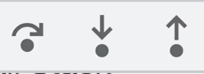

# Debugging React

### Understanding Error Messages

- React gives pretty clear error messages that are easy to understand.
- We can always look at the `Stack Trace` which can give us the line number an error occurred at.

### Using debugger

- Go to Sources tab, in there we can find the function/component we want to debug. Here we can leave breakpoints.

- Step through a statement
- Jump into a function that will be executed
- Jump out of a function

### Understanding Reacts Strict Mode

- Enable Strict mode in `index.js`
- It's a built-in component from React.

### Using React DevTools

- Can help with performance issues, using the Profiler
- We can use the Components to debug our components. Here we can state what hooks, what state, what props, etc... a components has.