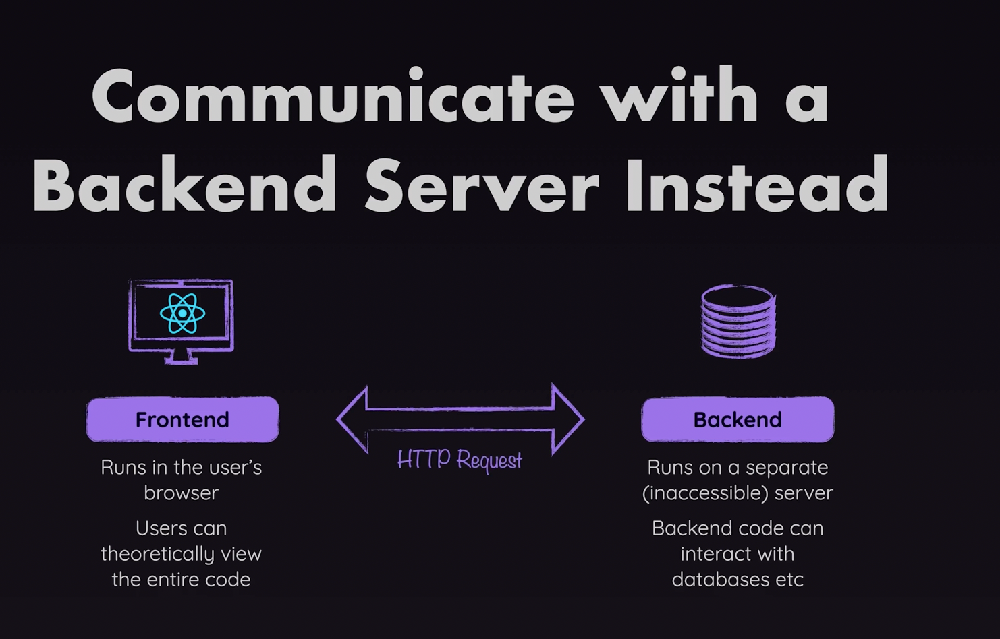
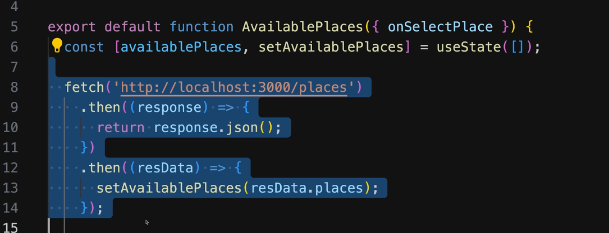
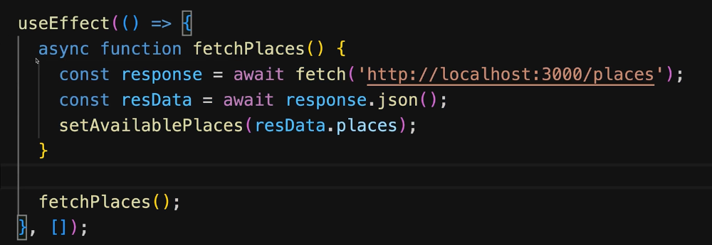

# HTTPS Requests in React

## How (not) to connect to a database?

- Keep in mind, your React code runs in the browser of your users, which means, they can view that code.
- If that code then contains any sensitive information, such as password to a database, our database can be compromised.
- Instead of doing this, we can have our React App communicate with a backend server.

## How NOT to send HTTP Requests (and how to do it properly)

- We can use the `fetch()` function to make http requests.

- Bellow, is a not good way of doing http requests in React. Why? It would create an infinite loop.
- Each time we make a request, the `setState` would cause a re-render, then again, and again.

- We can use a `useEffect` to fix this.

## Using Async/Await

