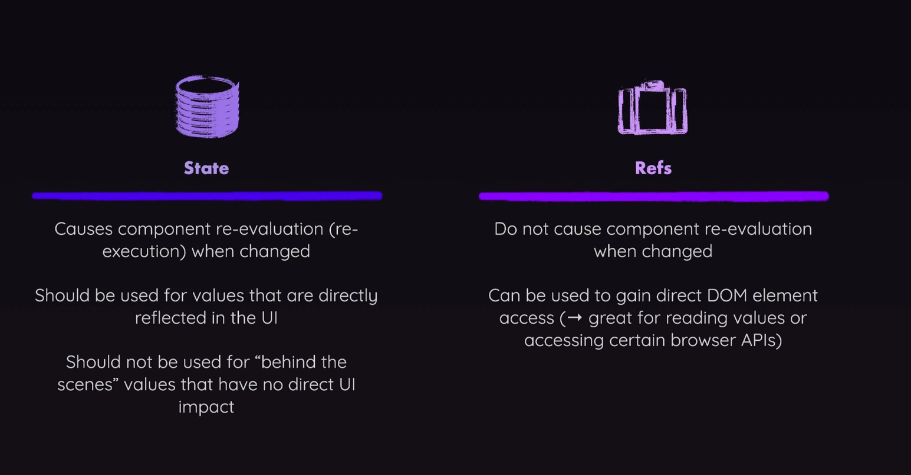

# Refs and Portals

## Two-way binding

- Two-way binding is basically managing User Input with State
```javascript react
const Player = () => {
    const [enteredPlayerName, setEnteredPlayerName] = useState(null);
    const [submitted, setSubmitted] = useState(false);
    
    function handleChange(event) {
        setEnteredPlayerName(events.target.value)
    }
    
    function handleClick() {
        setSubmitted(true);
    }
    
    return (
        <section id='player'>
            <h2>Welcome {submitted ? enteredPlayerName : 'unknown'}</h2>
            <p>
                <input type='text' onChange={handleChange} value={enteredPlayerName}/>
                <button onclick={handleClick}>Set Name</button>
             </p>   
        </section>
    )
}

```
- This component can be simplified by using refs.
- What is a Ref? It's a value, similar to state. 
- We can connect them to any elements, with a prop that is supported across all React components
- By using ref.current, we get access to all the elements properties, ALL OF THEM.

```javascript react
const Player = () => {
    const [enteredPlayerName, setEnteredPlayerName] = useState(null);

    const playerName = useRef();
  
    
    function handleClick() {
        setEnteredPlayerName(playerName.current.value)
    }
    
    return (
        <section id='player'>
            <h2>Welcome {enteredPlayerName ?? 'unknown'}</h2>
            <p>
                <input ref={playerName} type='text'/>
                <button onclick={handleClick}>Set Name</button>
             </p>   
        </section>
    )
}

```


### Difference between refs and state? 

- On first render, the ref will have an undefined value. Only on the second render, will it get the value of the element we assigned it to.
- Whenever a ref changes, the component does not re-render.


### Refs can do more than "DOM Element Connections"

- We can also use refs to manage any kinds of values. 
- Example: we can use it as a timer value.
- Good example: https://www.udemy.com/course/react-the-complete-guide-incl-redux/learn/lecture/39836346#questions

### Forwarding Refs

- We can pass refs around like props, instead we have to use `forwardRef` from React.
- To use it, we have to wrap the components that needs the ref received with the `forwardRef`.
- After the props argument, then the component receives a second parameter, a ref parameter.


```javascript
const ResultModal = forwardRef(function ResultModal({ result, targetTime }, ref) &
return (
<dialog ref={ref} className="result-modal">
    <h2>You {result}</h2>
        <р>
            The target time was < strong>{targetTime} seconds. </strong>
        </р>
        <p>
            You stopped the timer with ‹strong> seconds left.</strong>
        </p>
        <form method="dialog">
            <button>Close</button>
        </form> 
</dialog>
```


### Exposing Components APIs via the useImperativeHandle Hook

- Forwarding refs can have a small flaw in big projects where more developers work. 
- Let's say if a new developer comes, changes the dialog to a div, and then we are done.
- The `useImperativeHandle()` hook is used in tandem with `forwardRef()` to expose specific properties or methods of a component (these could be state values or instance methods) to a parent component or an external part of your React application. It's useful in scenarios where you need more direct interaction with a child component than is allowed through normal state/prop flows.

- While you can directly interact with instances of child components through a reference, this is generally discouraged in React as it breaks the typical one-way data flow model React encourages. However, there are situations where it might be necessary, for example, when you want to focus an input element in a child component from a parent component. By default, functional components in React cannot be given refs, but through forwardRef and useImperativeHandle, you can expose specific methods and properties to a parent component.

- It's recommended to use `useImperativeHandle` sparingly, as modifying or interacting with child elements directly can lead to a more confusing codebase over time. It's often better to rely on React's inherent state/props flow as much as possible.

```jsx
const Child = forwardRef((props, ref) => {
  useImperativeHandle(ref, () => ({
    focus: () => {
      // This function could be anything you want to expose
    },
  }));
});

function Parent() {
  const childRef = useRef();

  useEffect(() => {
    childRef.current.focus();
  }, []);

  return <Child ref={childRef} />;
}
```


## Portals

- If we render a modal, it will render in the component we  placed it in, also in the DOM tree.
- We can use portals to place the rendering of the modal to another place, such as the body, another divm, etc..
- This can help with accessibility issues, styling and more.
- This is not used that much anymore.