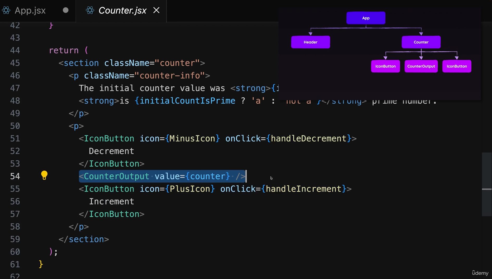

# React Under The Hood

## Building the component tree

### How does React update the DOM? How are the component functions executed?

- The whole rendering happens because of this line, usually in the `index.js`:

```javascript jsx
import ReactDOM from "react-dom/client"

ReactDOM.createRoot(document.getElementById('root')).render(<App />)
```

- First, state gets registered, functions get created (NOT EXECUTED), JSX Code gets executed.
- JSX Code is translated to JS code, then translated to actual elements for the browser.
- In the JSX Code we may have some regular elements (<div/>, etc..) and some other components (Header).
- React also goes ahead, and executes JSX line by line, executing the components in it along the way.
- When it comes to a component that needs to be rendered, React reaches that component, and executes it.

- Example:

```javascript tsx
return (
    <>
        <main>
            <Header/>
            <section>
                <h2>Counter</h2>
                <button>Click</button>
            </section>
            <Counter initialCount={count}/>
        </main>
        </>
)
```

- Notice that the `<Counter/>` has a props. React assigns the count value, to the initialCount prop, to the Counter component.
- Imagine now if `<Counter/>` also has some extra components in itself, described on this picture:




## Avoiding component Function Execution with memo()

- Link: https://www.udemy.com/course/react-the-complete-guide-incl-redux/learn/lecture/40270524#questions

- Let's say we have an input component in the `App.js`. This input component is tied to a state, that tracks keystrokes, or in other words, when someone enters something in it.
- This means, on every keystroke, every child will re-render as well.
- We can use the `memo()` function, by wrapping a component with it. It will take a look at the props of the component.
- The `memo()` compares prop values. If old prop value is equal to new prop value, the component wrapped will not execute!
- Make sure to understand, `memo()` cares only about external changes! Internal changes, will still execute the component.
- DON'T OVERUSE MEMO.
- USE IT AS HIGH UP IN THE COMPONENT TREE AS POSSIBLE.
- CHECKING PROPS WITH MEMO() COSTS PERFORMANCE.
- DON'T USE IT ON COMPONENTS WHERE PROPS WILL CHANGE FREQUENTLY.


## Avoiding component Function Execution with Clever Structuring

- We can always create a separate component and move it out of a parent component, and lift state up.


## useCallback explained

- `useCallback` can be used to avoid the recreation of a function. 
- Why? Let's say we have `Counter` component, which has a function `onClick` inside of it. We pass this function as a prop to another component called `Input` for example.
- We wrap the `Input` with a memo to make sure it doesn't unnecessarily re-render, but it won't work. Why?
- Because, the `onClick` function we are passing to it, gets recreated every time the `Counter` component re-renders, which means the children will re-render as well.
- This is why, we can use the `useCallback()` to fix this.
- Better explanation in the udemy course.

## useMemo explained

- What if we want to prevent the execution of normal functions and make sure that they get executed only when a certain value is changed?
- NOT THE SAME AS MEMO. MEMO IS USED TO WRAP COMPONENT FUNCTIONS, useMemo() IS USED TO WRAP NORMAL FUNCTIONS.


## Differences between memo, useCallback() and useMemo() according to AI

- `React.memo`, `useCallback`, and `useMemo` are all related to optimizing React function components by helping to prevent unnecessary re-renders or recalculations.

1. `React.memo` - is a higher order component that you wrap around a functional component to tell React to memorize the rendered output and only re-render if the props have changed.
2. `useCallback` - is a hook that will return a memoized version of the callback function that only changes if one of the dependencies has changed.
3. `useMemo` - is a hook that will only recompute the memoized value when one of the dependencies has changed. This optimization helps to avoid expensive calculations on every render.

- In summary:
1. `React.memo` is used to memoize components.
2. `useCallback` is used to memoize functions.
3. `useMemo` is used to memoize values or results of function.


Examples: 

### useMemo

- Imagine that you have a list of 1,000 products. Each of these products has a price and a tax value. On your webpage, you want to display the price after tax for all the products, which you calculate in your component. Rather than re-calculating this every render, you could useMemo to save that calculation:

```javascript
const priceAfterTax = useMemo(() => {
    return products.map(product => {
        return product.price + product.tax;
    });
}, [products]);

```
- Here, useMemo is used to optimize the process by only re-computing this value when the 'products' array changes.

### useCallback

- Imagine you have a parent component that renders a large list of Child components. Each Child component gets an onClick handler handleClick passed as a prop. Every time the Parent component re-renders for any reason, it re-creates the handleClick function.

```javascript
const Parent = () => {
    const [count, setCount] = useState(0);

    const increment = () => setCount((c) => c + 1);

    const handleClick = (id) => {
        console.log(`Clicked item ${id}`);
    };

    return (
        <div>
            <button onClick={increment}>Increment Counter: {count}</button>
            {items.map((item) => (
                <Child key={item.id} onClick={handleClick} />
            ))}
        </div>
    );
};
```

- This can cause a performance issue because every Child component gets new prop with every render of the Parent, causing unnecessary re-rendering of every Child component, even though the handleClick function does the same thing every time.

- If the Child component is large or complex, and the rendering is expensive, this could cause a noticeable performance problem.

- Here's where useCallback can be used to improve performance:

```javascript
const Parent = () => {
    const [count, setCount] = useState(0);

    const increment = () => setCount((c) => c + 1);

    const handleClick = useCallback((id) => {
        console.log(`Clicked item ${id}`);
    }, []);

    return (
        <div>
            <button onClick={increment}>Increment Counter: {count}</button>
            {items.map((item) => (
                <Child key={item.id} onClick={handleClick} />
            ))}
        </div>
    );
};
```

## Why Keys Matter When Managing State?

- This is what makes components reusable. Let's say we have one state:

```javascript jsx

//state in Counter.jsx
const [counter,setCounter]=useState(initialCount);

// return in App.jsx
// Both counters have the same code, but both instances have their own isolated state
return (
    <>
    <Counter initialCount={chosenCount}/>
     <Counter initialCount={0}/>   
    </>
)
```

- State is also tracked by position in React. This is why the key is important.
- When mapping a component, we have to include a key. React will map the state accordingly to the key.
- Imagine you have list of orders on many pages. You can open each order item to see a summary. If you open item 3 on page 1, you go to page 2, item 3 on page 2 will also be open, and so on.
- If we include a key, the state will be unique to each mapped element.
- Adding keys also hase more benefits. If there is no unique keys, mapped components will all be re-rendered. If there are unique keys, only the one that actually needs a re-render will re-render


## State Scheduling and Batching

- When calling a `setState`, it gets scheduled, and not immediately executed. (if we set a state, and console.log the state right away, it won't work)
- Also, if we have 2 state updates they won't cause 2 re-renders. This is because React performs batching, which means that multiple state updates, that are done in one function for example, are batched together and will only leave to 1 component re-render.

## MillionJS

- Make React faster.
- Replaces React VirtualDOM mechanism with a better one.